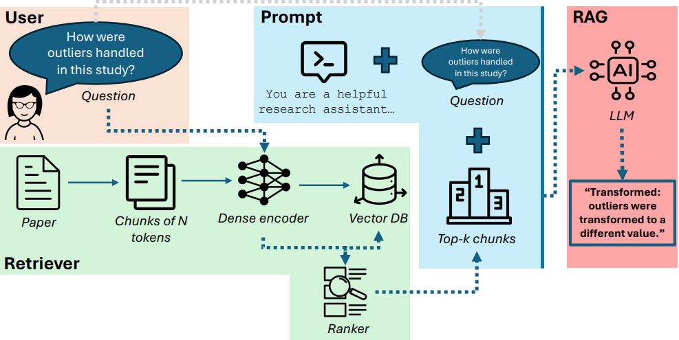

# OpenExtract

OpenExtract is an open-source pipeline for structured data extraction from text. It uses Retrieval Augmented Generation (RAG) to select the most appropriate answers on questions based on relevant sections of PDF documents. 




OpenExtract is built on the OpenRouter interface, which allows it to support a wide variety of Large Language Models. The RAG component uses dense retrieval with sentence embedders from Hugging Face.

# Usage
This repository already contains a sample use case to guide you in using OpenExtract. The use case pertains to data extraction for a systematic literature review in Digital Health. You can use OpenExtract for your own use case as follows:

- **Generate API key**: make an account on [OpenRouter](https://openrouter.ai/) and generate an API key.
- **Set prompts**: alter the prompts.json file to provide instructions for LLMs to answer your questions and/or extract data from documents.
- **Define questions**: alter the questions.json file to extract data or information relevant to your use case. Note that we currently only support multiple-choice extraction. 
- **Install dependencies and run OpenExtract as follows**:

```bash
pip install -r requirements.txt
```

```bash
python main.py --papers-dir {PAPERS} --output-dir {OUTPUTS} --questions-file {QUESTIONS} --model {MODEL} --dense-model {DENSE} --top-k {K} --chunk-tokens {CHUNK} --chunk-overlap {OVERLAP} --api-key-file {KEY} 
```

- PAPERS: directory containing documents (pdf files) to extract information from.
- OUTPUTS: output directory.
- QUESTIONS: JSON file containing questions to be used for information extraction.
- MODEL: Large Language Model as per OpenRouter model ID, e.g., qwen/qwen-2.5-7b-instruct.
- DENSE: sentence embedder for dense retriever as per Hugging Face model ID, e.g., neuml/pubmedbert-base-embeddings. 
- K: amount of most relevant chunks to pass to the Large Language Model.
- CHUNK: amount of tokens per chunk.
- OVERLAP: amount of overlapping tokens between chunks.
- KEY: path to txt file containing OpenRouter API key. Can also omit, but then you need to set the API key as environment variable (OPENROUTER_API_KEY). 


# Reproducing results from paper
This repository was used for the paper entitled "OpenExtract: Automated Data Extraction for Systematic Reviews in Health". To reproduce the results from the paper, run the pipeline using the following arguments:

```bash
python main.py --papers-dir {PAPERS} --output-dir {OUTPUTS} --questions-file {QUESTIONS} --model {MODEL} --dense-model neuml/pubmedbert-base-embeddings --top-k 3 --chunk-tokens 1000 --chunk-overlap 500 --api-key-file {KEY} --random-subset 50 --random-seed 42 --stop-after-n-papers 10
```

To evaluate OpenExtract's results as compared to manual data extraction, we provide an Excel macro to perform manual data extraction. Follow the instructions in the [notebook](evaluation.ipynb). This Excel macro also provides more insight into which data extraction is considered in the paper. This can also be investigated through the manual data extraction performed by the researchers [here](./manual_extraction/).

The same notebook can also be used to calculate the scores as provided in the paper: inter-rater agreement (Cohen's kappa) and precision-recall scores.
